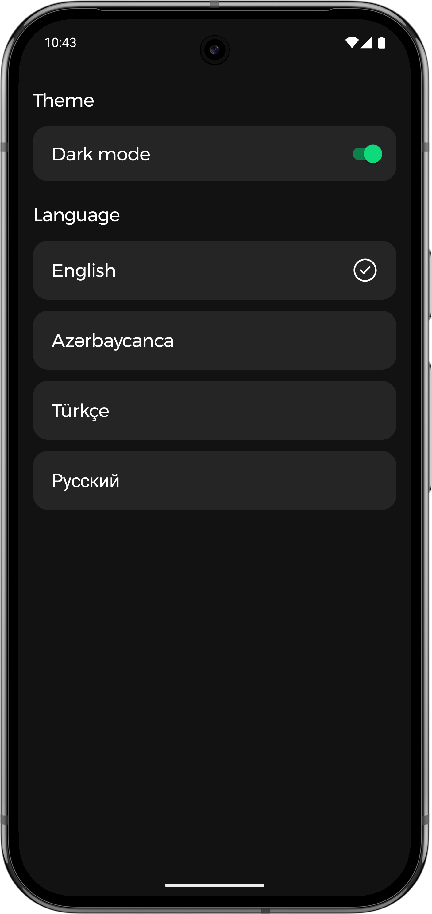
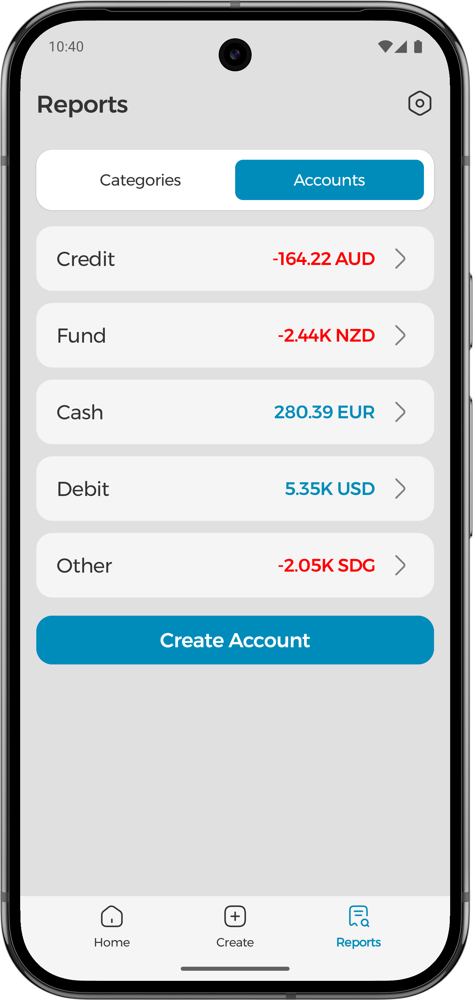
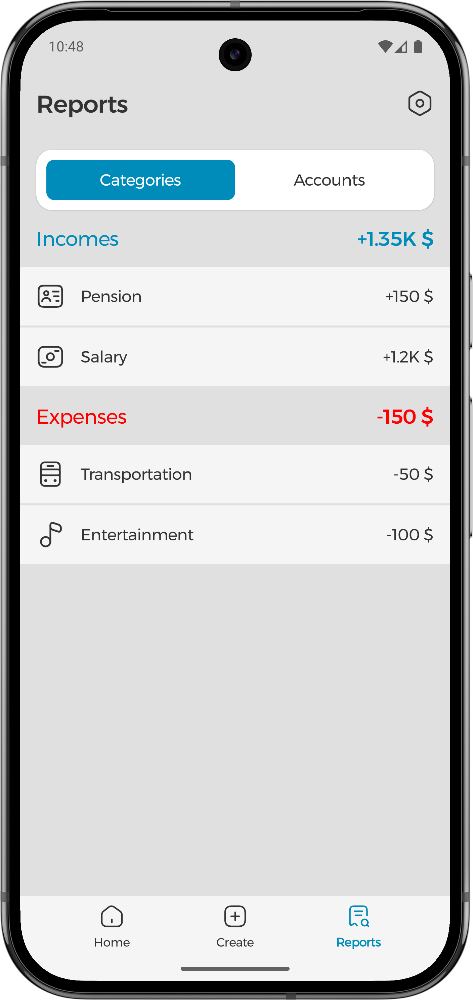
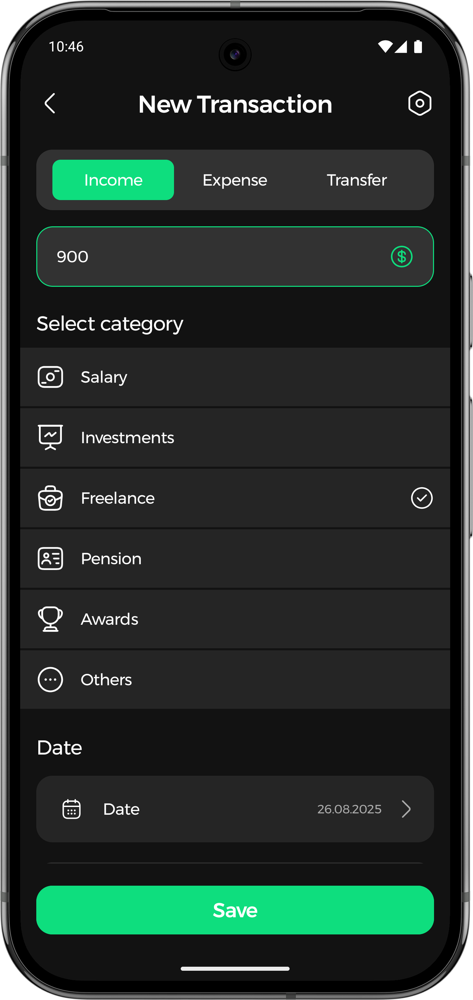
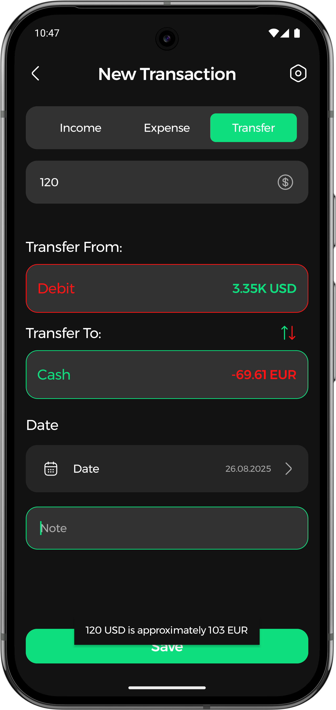
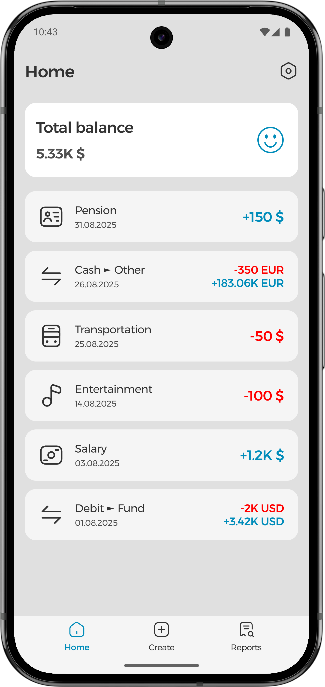
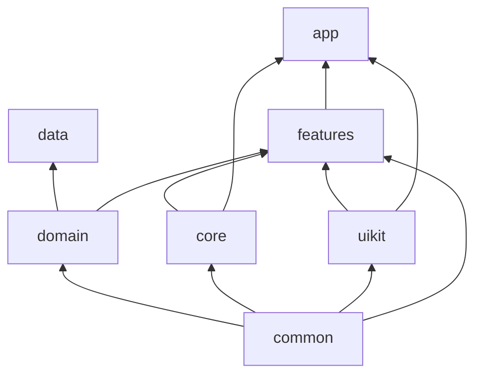
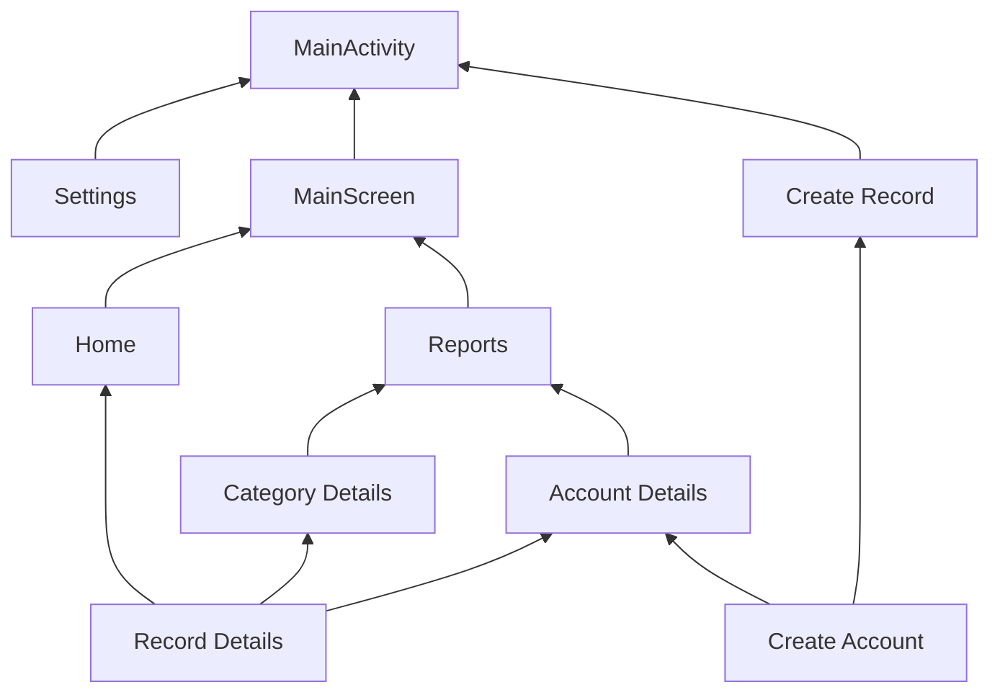

# BudgetBoss

A comprehensive expense tracking Android application built with Android development practices, featuring multi-currency support, account management, and financial reporting.

## Screenshots

|Settings|Accounts|Categories|
|:---:|:---:|:---:|
||||

|Income|Transfer|Home|
|:---:|:---:|:---:|
||||

## Features

### Core Functionality

- **Record Management**: Create and manage expense and income records
- **Account Management**: Create accounts with different currencies
- **Multi-Currency Support**: Automatic currency conversion via remote API
- **Transfer Operations**: Transfer funds between accounts
- **Categorization**: Assign categories to income and expense records
- **Notes & Dating**: Add notes and dates to records with update capabilities

### User Experience

- **Multi-language Support**: Internationalization with multiple language options
- **Theme Support**: Light and dark theme options

### Analytics

- **Firebase Analytics Integration**: Track account currencies and selected categories as events

## Architecture

The application follows a modular architecture with Clean Architecture principles and MVI (Model-View-Intent) pattern.

### Module Structures

### Feature Dependencies

## Technical Stack

### Architecture Pattern

- **MVI (Model-View-Intent)**: Unidirectional data flow with State, Event, and Effect handling
- **Clean Architecture**: Separation of concerns with clear layer boundaries
- **Modular Structure**: Feature-based modularization for better maintainability

### Core Technologies

- **Android Room**: Local database for offline data persistence
- **Hilt (Dependency Injection)**: Compile-time dependency injection
- **Navigation Component**: Type-safe navigation with NavGraphs
- **Retrofit**: HTTP client for remote API integration and currency conversion

### Development Practices

- **Base Classes**: BaseFragment and BaseViewModel for common functionality
- **Repository Pattern**: Abstract repository interfaces in domain layer
- **Use Cases**: Business logic encapsulation
- **State Management**: Reactive state handling with MVI pattern

## Module Structure

The application is organized into modular layers following Clean Architecture:

- **Common**: Shared utilities and base classes
- **Core**: Base fragments, ViewModels, and Android dependencies
- **UIKit**: Reusable components and theme definitions
- **Domain**: Business logic, entities, and repository abstractions
- **Data**: Repository implementations and database operations
- **Features**: UI screens and feature-specific logic
- **App**: Application entry point and navigation setup

## Database Schema

The application uses Android Room for local data persistence with the following main entities:

- Records (Income/Expense)
- Accounts
- Categories
- Transfers

## API Integration

- **Currency Exchange**: Real-time currency conversion rates
- **Multi-currency Support**: Automatic rate fetching and conversion

## Analytics & Tracking

Firebase Analytics events are tracked for:

- Account currency selections
- Category usage patterns
- User interaction patterns

## Development Setup

1. Clone the repository
2. Open in Android Studio
3. Sync Gradle dependencies
4. Configure Firebase project (add `google-services.json`)
5. Set up API keys for currency conversion service (at the NetworkModule.kt)
6. Build and run the application

## Contributing

This project follows Clean Architecture principles and MVI pattern. Please ensure:

- New features follow the established module structure
- State management follows MVI pattern
- Repository pattern is maintained for data operations
- Navigation uses the established NavGraph structure
